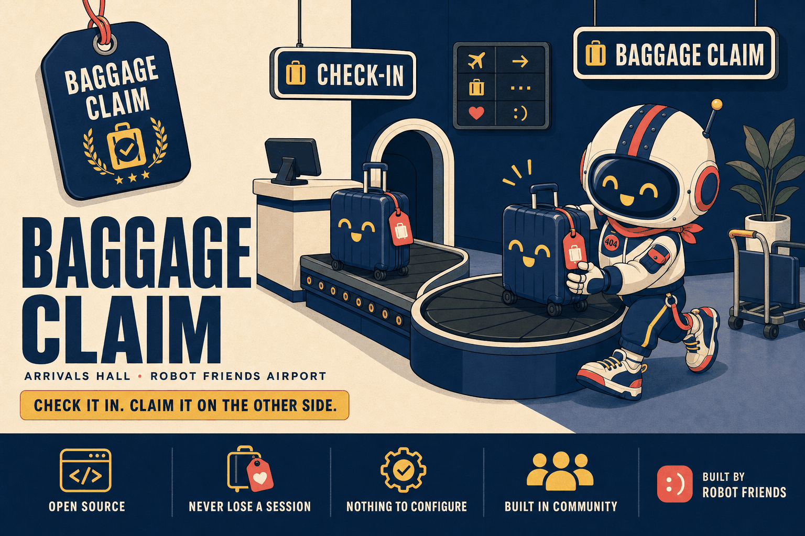

<div align="center">



</div>

<div align="center">

**The two-command context handoff for Claude Code. Check your work in before you clear. Claim it on the other side.**

[](https://claude.ai/code)
[](LICENSE)
[](https://github.com/Robot-Friends-Community)

</div>

---

## What is this?

At the airport you hand your bag over at the counter, walk through with nothing in your
hands, and pick the same bag up from the carousel on the other side. You don't carry it
through security. You don't think about it in between. It's just there when you land.

**Baggage Claim** does that for your Claude Code session.

Every session has a memory limit. When it fills up you `/clear` — and everything Claude
knew about what you were doing, what you'd decided, and what came next is gone. Baggage
Claim is the counter and the carousel:

- **`/checkin`** — before you clear, Claude writes what it knows into one small file,
  `BAGGAGE.md`, in your project folder: the goal, what's done, what's left, the decisions
  you made and why, anything stuck, and the very next thing to do.
- **`/claim`** — in the fresh session, Claude reads that file back, shows you where you
  were, and suggests the next step. You say yes and keep going.

That's the whole thing. Two commands, one file, nothing to configure.

---

## Who is it for?

| You are… | Baggage Claim gives you… |
|---|---|
| **New to Claude Code** | The one habit that stops you losing work, learnable in a minute |
| **Not an engineer** | Plain-language summaries — no git, no config, no jargon |
| **Working in short bursts** | A clean pick-up point every time you come back |
| **Already using [Airport Authority](https://github.com/Robot-Friends-Community/airport-authority)** | Nothing — you have this and much more. Stay there. |

**Start here if Airport Authority is more than you need.** Airport Authority is the full
edition: a build log across sessions, project memory, repo hygiene, a fleet view. Most
people don't need any of that on day one. They need to not lose their work. This is that.

---

## Install

```bash
claude plugin marketplace add Robot-Friends-Community/baggage-claim
claude plugin install baggage-claim@baggage-claim
```

That's it. No dependencies, no accounts, no keys.

<details>
<summary>Don't want to use plugins? Copy the two skills by hand.</summary>

```bash
# macOS / Linux
git clone https://github.com/Robot-Friends-Community/baggage-claim.git
cd baggage-claim && bash install.sh
```

```powershell
# Windows (PowerShell)
git clone https://github.com/Robot-Friends-Community/baggage-claim.git
cd baggage-claim; .\install.ps1
```

The script copies `skills/checkin` and `skills/claim` into your Claude Code folder, and
removes the old no-look-pass edition if it finds one.

</details>

---

## Your first trip

> Always run these from inside the project you're working on — the bag is saved there.

1. Open Claude Code in your project and work as normal.
2. When the context is getting full (or you're about to stop for the day), type **`/checkin`**.
   Claude writes `BAGGAGE.md` and tells you it's safe to clear.
3. Type **`/clear`**.
4. Type **`/claim`**. Claude reads the bag, shows you where you were, and asks
   *"Ready to continue?"*
5. Say yes.

```
You:     /checkin

Claude:  🧳 Checked in: BAGGAGE.md

           Project    my-shop-site
           Objective  Add a newsletter sign-up to the footer
           Progress   60% · 3/5 items
           Next       Wire the form to the mailing-list API

         Safe to /clear. Run /claim in the new session to pick it up.

You:     /clear
You:     /claim

Claude:  🧳 Claimed: BAGGAGE.md  (2026-09-22T18:40Z)

           Project    my-shop-site
           Objective  Add a newsletter sign-up to the footer
           Progress   60% · 3/5 items

           Remaining
             ☐ Wire the form to the mailing-list API
             ☐ Show a thank-you message after submit

           Decisions kept
             • Footer, not a pop-up — pop-ups were annoying visitors

           ➡️  Next   Wire the form to the mailing-list API

         Ready to continue? [Y/n]
```

**When should I check in?** Whenever you'd be annoyed to lose what Claude currently knows.
Before a `/clear`, before you close the laptop, before you hand the project to someone
else. It takes a few seconds and there's no downside to doing it too often.

---

## What's in the bag

`BAGGAGE.md` is a plain Markdown file you can open and read yourself. It holds:

| Section | What it answers |
|---|---|
| **Objective** | What are we trying to get done? |
| **Progress** | What's done, what's left |
| **Decisions** | What we chose, and why — so the next session doesn't re-argue it |
| **Blockers** | Anything stuck |
| **Uncommitted changes** | What's changed on disk but isn't saved to git yet |
| **Next action** | The first concrete thing to do when you're back |
| **Notes for next time** | Gotchas, live file paths, the approach in flight |

It lives in your project folder. Delete it when you've claimed it (Claude offers), keep
it, or archive it — your call. It never leaves your machine.

---

## What's inside

| File | What it does |
|---|---|
| `skills/checkin/SKILL.md` | The `/checkin` skill — how Claude gathers and writes the bag |
| `skills/claim/SKILL.md` | The `/claim` skill — how Claude finds, reads and presents it |
| `install.sh` / `install.ps1` | Manual install, if you'd rather not use plugins |
| `assets/` | The banner and the prompt that regenerates it |

Two skills. That's the point.

---

## When you outgrow it

You'll know. You'll want to remember *why* something was decided three weeks ago, or
you'll be running several projects and want to see them all at once, or you'll want
someone to keep an eye on commits and pushes for you.

That's [**Airport Authority**](https://github.com/Robot-Friends-Community/airport-authority).
Its `/takeoff` and `/landing` are `/checkin` and `/claim` grown up — same idea, plus a
Flight Recorder that keeps the whole story, a Flight Engineer that handles the git
plumbing in plain language, and a tower view of every project.

---

## Lineage

Baggage Claim is **gen 1** of an idea Robot Friends has been refining in the open:

| Gen | Project | The idea |
|---|---|---|
| 1 | **Baggage Claim** *(formerly no-look-pass)* | Check your context in, claim it on the other side. Two commands, one file. |
| 2 | flight-deck | The handoff grows a black box — an accumulating build log across sessions. |
| 3 | [Airport Authority](https://github.com/Robot-Friends-Community/airport-authority) | The whole tower: continuity **+** durable project memory **+** repo hygiene **+** a fleet view, as one plugin. |

Gen 1 was called *no-look-pass* (basketball: throw the ball to where your teammate will be)
and picked up a game-film log of its own in v2. In v3 it moved into the airport with its
siblings and went back to being the small, obvious thing: the beginner edition. If you
want the film log, you want Airport Authority.

Same universe as [DoPA](https://github.com/Robot-Friends-Community/dopa) (the port
authority for your local dev servers) and
[Customs Authority](https://github.com/Robot-Friends-Community/customs-authority) (the
decision layer) — institutions with a mandate, so you don't have to remember.

## Contributing

Clearer wording, better summaries, bug fixes: yes please. Anything that makes it bigger
belongs in Airport Authority. See [CONTRIBUTING.md](CONTRIBUTING.md).

## License

MIT © Robot Friends (404NOTFOUND LLC)
